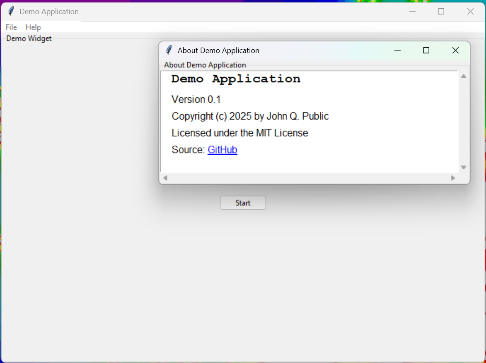
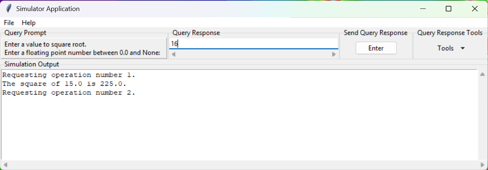
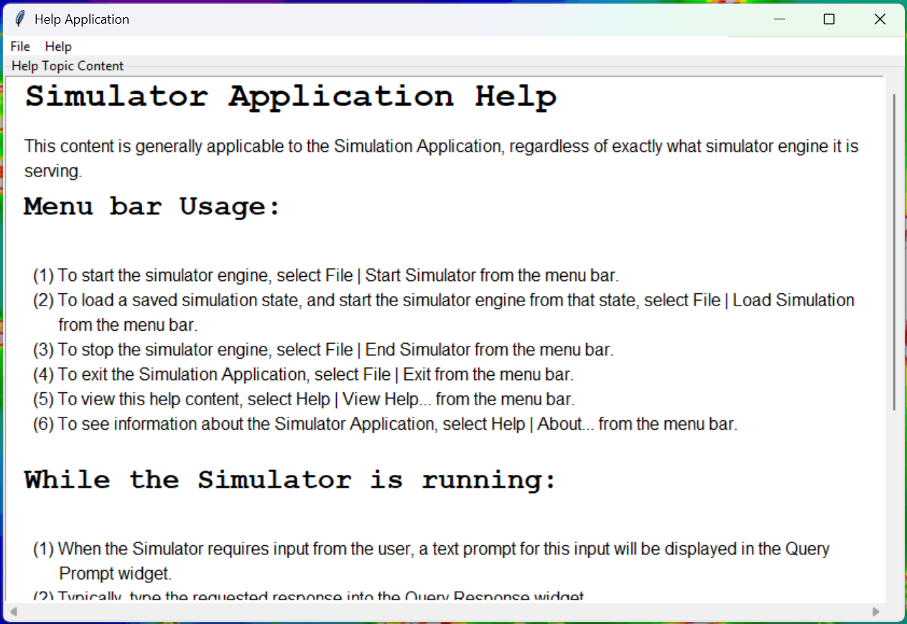
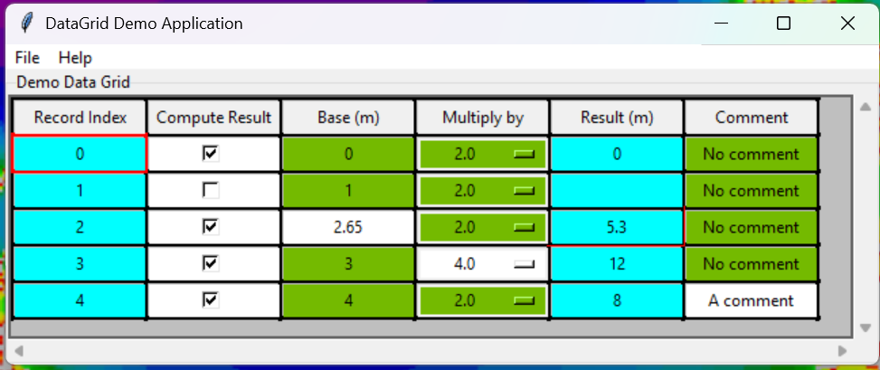
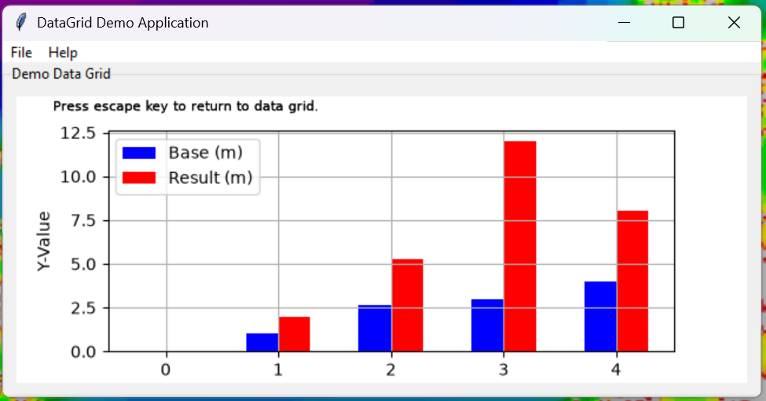

# tkAppFramework

Source code: [GitHub](https://github.com/KevinRGeurts/tkAppFramework)
---
tkAppFramework is a Python library that facilitates the creation of a GUI application using tkinter. It provides:

1. a base application class (tkApp)
2. a base view manager class (tkViewManager)
3. a base data and business logic class (Model)
4. a base class so that GUI widgets managed by the view manager can act as observed subjects (Subject) in the Observer design pattern
5. an application class (tkHelpApp) launched to display help content (.txt, .html, or .md) when a tkApp's Help | View Help... menu item is selected
6. a dialog class (tkAppAboutDialog) launched to display application "about" information when a tkApp's Help | About... menu item is selected
7. a simulator application class (tkSimulatorApp) that can be used by any "simulator" (see requirements below) by implementing a SimulatorAdapter child class
8. a reusable tkXHTMLViewerWidget when can be embedded as a child widget of any tkViewManager child class, and used to display HTML formatted text
9. a reusable tkDataGridWidget that can be used to display data in a grid format, with the ability to edit the data in the grid, and to display graphs of the data in the grid 



## Requirements

1. matplotlib>=3.11.0: [GitHub](https://github.com/matplotlib/matplotlib), [PyPi](https://pypi.org/project/matplotlib/) 
2. justhtml>=1.9.0: [GitHub](https://github.com/emilstenstrom/justhtml), [PyPi](https://pypi.org/project/justhtml/)
3. markdown>=3.10.2: [GitHub](https://github.com/Python-Markdown/markdown), [PyPi](https://pypi.org/project/Markdown/)
4. UserResponseCollector>=1.1.0: [GitHub](https://github.com/KevinRGeurts/UserResponseCollector), [PyPi](https://pypi.org/project/UserResponseCollector/)

The `matplotlib` package is used by the `tkDataGridWidget` module, where it is used to display graphs of data in a data grid.
The `markdown` and `justhtml` packages are used by the `HelpModel` class, which is the business logic for `tkHelpApp`.
The `UserResponseCollector` package is used by `tkSimulatorApp` to receive input requests from the simulator.

## Credit where credit is due

- Adapter, Observer, Mediator, and Factory Method patterns follow the concepts, UML diagrams, and examples provided in
  "Design Patterns: Elements of Reusable Object-Oriented Software," by Eric Gamma, Richard Helm, Ralph Johnson,
  and John Vlissides, published by Addison-Wesley, 1995.
- The implementations of ```tkApp``` and ```tkViewManager``` leverage concepts from Chapter 11 of "Programming Python,"
  by Mark Lutz, published by O'Reilly, 1996. In particular, ```tkApp``` takes a similar approach to Mr. Lutz's
  ```GuiMaker``` class by using a python dictionary to configure it's menu bar.
- This framework also borrows concepts from Microsoft's Foundation Classes (MFC), which I learned in the late 1990's.
- The Simulator Application framework leverages concepts from Mark Roseman's https://tkdocs.com/tutorial/eventloop.html.

## tkApp class

tkApp is an abstract base class from which concrete tkinter applications can be derived.

Concrete implementation child classes must:
- Implement the factory method ```_createViewManager()``` to create and return a tkViewManager instance,
  which will create and manage the widgets of the application.
- Implement the factory method ```_createModel()``` to create and return a Model instance.
  
Concrete implementation child classes likely will:
- Pass AboutAppInfo named tuple into ```__init__()``` to set up the app's About dialog.
- Pass menu_dict parameter into ```super.__init__()``` to set up the app's menubar.
- Pass file_types parameter into ```super.__init__()``` to set up the file types for file dialogs.
- Define and implement handler functions for menubar selections, beyond ```OnFileOpen```, ```OnFileSave```,
  ```OnFileSaveAs```, ```OnFileExit```, ```OnViewHelp```, and ```OnHelpAbout```.

Concrete implementation child classes may:
- Extend ```_setup_child_widgets()``` if the tkViewManager does not create all of the app's widgets.
- Extend logging setup in ```_setup_logging(...)``` if application specific logging is desired.

A logger named 'tkApp_logger' is created and configured in _setup_logging(...), which is called by ```__init__(...)```.
It logs to stderr through a stream handler. Default logging level is logging.INFO, but can be set by passing
log_level into ```__init__(...)```. The 'tkApp_logger' logger can be used by concrete implementation child classes of tkApp.

## tkViewManager class

tkViewManager is an abstract base class from which concrete view mangers for tkinter applications can be derived.
Concrete child implementations create widgets for tkApp concrete child implementations and handle the interactions
between widgets.

The tkViewManager class follows the Mediator design pattern and acts as Observer. tkViewManager is also a ttk.Frame.

Concrete implementation child classes must:
- Implement the method ```_CreateWidgets()```, which is called by ```__init__(...)``` to create and set up the child widgets
  of the tkViewManager widget.
- Define and implement handler functions for widget updates, e.g., ```def handle_x_widget_update(self):```.
Notes:
- Handler functions are registered with the tkViewManager via ```register_subject(...)```, typically after each widget is created in ```_CreateWidgets()```. 
- Handler functions are automatically called from the ```update(...)``` method when a subject (child widget) notifies the tkViewManager by calling ```notify()``` on itself.

## Model class

Model is an abstract base class Model, from which classes representing the data and business logic of an application
can be derived.

Concrete implementation child classes likely will:
- Implement ```readModelFromFile()``` method for reading model data from a file-like object.
    Notes:
    - Before reading from a file, the model may need to clear existing data.    
    - After reading from a file, the model should call self.notify() to inform observers of changes.
- Implement ```writeModelToFile()``` method for writing model data to a file-like object.

## Observer / Subject classes

The tkAppFramework also includes base classes for implementing the Observer design pattern. As described above,
tkViewManager is an Observer. Concrete child implementations of tkViewManager will typically observe one or more
child widgets, which are typically child implementations of tkinter.Labelframes and also Subjects.

### Observer class
Observer is a base class for all objects that will be an Observer in an Observer design pattern. All Observer child classes should:
- Call ```register_subject(subject, update_handler)``` for each Subject object that the Observer child class should observe.
- Define and implement the update_handler functions that are registered with ```register_subject(...)```. These functions will be called when the Subject object notifies this Observer object by calling ```notify()``` on itself.
- Call ```_detach_from_subjects()```, for example, from ```onDestroy(...)```, to detach this Observer object from all Subject objects that it is observing.

### Subject class
Subject is a base class for all objects that will be a Subject in an Observer design pattern.
Subjects should ```attach(...)``` and ```detach(...)``` Observers, and ```notify()``` them of changes in state.

## Usage

The code below shows a minimalist concrete implementation of tkApp and tkViewManager. The app is created and
launched.

```python
import tkinter as tk
from tkinter import ttk
from tkAppFramework.tkApp import tkApp, AppAboutInfo
from tkAppFramework.tkViewManager import tkViewManager
from tkAppFramework.ObserverPatternBase import Subject
from tkAppFramework.model import Model


class DemoModel(Model):
    """
    A concrete implementation of Model for the demo application.
    """
    def __init__(self) -> None:
        super().__init__()
        self._count = 0

    @property
    def count(self):
        return self._count

    @count.setter
    def count(self, value):
        self._count = value
        self.notify()        


class DemoWidget(ttk.LabelFrame, Subject):
    """
    Class represents a tkinter label frame widget and is also a Subject in Observer design pattern.
    It has a button widget that will change it's text cyclicly from 'Start' to 'Stop' when clicked.
    """
    def __init__(self, parent) -> None:
        ttk.Labelframe.__init__(self, parent, text='Demo Widget')
        Subject.__init__(self)
        
        btn = ttk.Button(self, command=self.OnButtonClicked)
        # Place button in grid and set weights for stretching the column and row in the grid
        # so that the demo widget resizes correctly.
        btn.grid(column=0, row=0)
        self.columnconfigure(0, weight=1)
        self.rowconfigure(0, weight=1)
        # Create string variable which will be the text displayed on the button
        self._lbl=tk.StringVar()
        self._lbl.set('Start')
        btn['textvariable']=self._lbl
        
        self._is_started = False

    def get_state(self):
        """
        Return whether the widget's state is started or stopped. Returns this as a bool which is True if started,
        and False if NOT started (that is, stopped).
        :return _is_Started: True if started, False if stopped, bool
        """
        return self._is_started
    
    def OnButtonClicked(self):
        """
        Event handler for button click.
        :return None:
        """
        # Flip the started state
        if self._is_started:
            # Widget state is currently started, so change state to stopped
            self._is_started = False
            # Change button text to 'Start'
            self._lbl.set('Start')
        else:
            # Widget state is currently stopped, so change it's state to started
            self._is_started = True
            # Change button text to 'Stop'
            self._lbl.set('Stop')

        # Notify observers
        self.notify()

        return None


class DemotkViewManager(tkViewManager):
    """
    Provide an implementation of _CreateWidgets(...). Implements handler functions for updates from the model
    and the demo widget.
    """
    def _CreateWidgets(self):
        """
        Create the demo widget, register 
        :return None:
        """
        dw = DemoWidget(self)
        # Attach self as an observer of the subject demo widget
        dw.attach(self)
        # Register a handler function for updates from the subject demo widget
        self.register_subject(dw,self.handle_demo_widget_update)
        # Place demo widget in grid and set weights for stretching the column and row in the grid
        # so that the demo widget resizes correctly.
        dw.grid(column=0, row=0, sticky='NWES')
        self.columnconfigure(0, weight=1)
        self.rowconfigure(0, weight=1)
        return None

    def handle_model_update(self):
        """
        Handle updates from the model.
        :return None:
        """
        print(f"Model count of button clicks is {self.getModel().count}")
        return None
    
    def handle_demo_widget_update(self):
        """
        Handle updates from the demo widget.
        :return None:
        """
        # Inform the model that the demo widget's state has changed (that is, the button was clicked),
        # so that the model can maintain a count of the button clicks / state changes.
        self.getModel().count += 1
        return None


class DemotkApp(tkApp):
    """
    Provide implementations of _createViewManager() and _createModel() factory methods.
    """
    def __init__(self, parent):
        info = AppAboutInfo(name='Demo Application', version='0.1', copyright='2025', author='John Q. Public',
                            license='MIT License', source='GitHub')
        super().__init__(parent, title="Demo Application", app_info=info, file_types=[('Text file', '*.txt')])

    def _createViewManager(self):
        """
        Concrete Implementation, which returns a DemotkViewManager instance.
        :return: tkViewManager instance that will be the app's view manager
        """
        return DemotkViewManager(self)

    def _createModel(self):
        """
        Concrete Implementation, which returns a DemoModel().
        :return: DemoModel instance that will be the app's model
        """
        return DemoModel()


# Get Tcl interpreter up and running and get the root widget
root = tk.Tk()
# Create the demo app
app = DemotkApp(root)
# Start the app's event loop running
app.mainloop()
```

## Demonstration

To run the Demo Application, type ```python -m tkAppFramework.main``` in a terminal window. Note, that this assumes that the
tkAppFramework package has been installed in your Python environment. In the terminal window, choose option (d).
The Demo Application is the same as the code shown above in the Usage section of this document. If you choose option (s),
then a simple demonstration of the Simulator Application will be launched. If you choose option (g), then a simple demonstration
of an application with a tkDataGridWidget will be launched.

## Simulator Application

The tkAppFramework package also includes a framework for creating applications that serve as a GUI for simulators.
A simulator is a program that, when run, periodically requests input from the user, performs calculations based
on that input, and then outputs results to the user. The Simulator Application is a GUI that presents input requests
from the simulator to the user, collects the user's input, and returns that input to the simulator. It also
dispalys the simulator's output to the user.



What is inherently true about a Simulator Application, is that the simulator controls the execution flow. In a
typical GUI application, the GUI's event loop controls the execution flow, and the business logic code
responds to requests from the GUI based on the user's interactions with the GUI's widgets. In the Simulator Application,
once the simulator is started, it controls the execution flow, and sends input requests and output data to the GUI.
Thus the Simulator Application inverts the typical GUI application architecture.

The Simulator Application framework is implemented in the tkSimulatorApp, tkSimulatorViewManager, SimulatorModel,
SimulatorAdapter, tkUserQueryViewManger, and tkUserUserQueryReceiver classes. Assuming that the simulator meets
certain requirements, then the only code that needs to be written to hook it up to the Simulator Application is
to implement a concrete child class of SimulatorAdapter. The simulator must:

(1) Request all user input through the UserResponseCollector package.
(2) Provide all ouput through the standard logging package.
(3) Be able to run in a separate thread from the GUI's event loop.
(4) Stop execution gracefully when a UserResponseCollector.UserQueryReceiverTerminateQueryingThreadError is raised.

The concrete SimulatorAdapter must extend the ```run()``` method, which should call a method of ```self._simulator```
to start a simulation, and then call ```super().run()```. The usage example below matches the demonstration Simulator Application
described in the Demonstration section of this document.

### Usage

```
# Standard imports
import tkinter as tk
import logging
from math import sqrt

# Local imports
from tkAppFramework.tkSimulatorApp import tkSimulatorApp
from tkAppFramework.sim_adapter import SimulatorAdapter
from UserResponseCollector.UserQueryCommand import askForFloat
import UserResponseCollector.UserQueryReceiver

class DemoSimulator:
    """
    This class is a very simple simulator. In a loop, until terminated, it asks the user for a floating point
    value, squares the value, and logs it.
    """
    def __init__(self, log_level=logging.INFO):
        """
        All that needs to be done is to set up logging.
        :param log_level: The logging level to set for the logger, e.g., logging.DEBUG, logging.INFO, etc.
        """
        # Create a logger with name 'demo_simulator_logger'. This is NOT the root logger, which is one level up from here, and has no name.
        logger = logging.getLogger('demo_simulator_logger')
        # This is the threshold level for the logger itself, before it will pass to any handlers, which can have their own threshold.
        # Should be able to control here what the stream handler receives and thus what ends up going to stderr.
        # Use this key for now:
        #   DEBUG = debug messages sent to this logger will end up on stderr
        #   INFO = info messages sent to this logger will end up on stderr
        logger.setLevel(log_level)
        # Set up this highest level below root logger with a stream handler
        sh = logging.StreamHandler()
        # Set the threshold for the stream handler itself, which will come into play only after the logger threshold is met.
        sh.setLevel(log_level)
        # Add the stream handler to the logger
        logger.addHandler(sh)

    def go(self):
        """
        Execute a simulation.
        :return: None
        """
        logger = logging.getLogger('demo_simulator_logger')
        while count < 2:
            try:
                logger.info(f"Requesting operation number {count+1}.")
                response= askForMenuSelection('What operation do you want?', {'s':'square a number', 'r':'square root of a number'})
                match response:
                    case 's':
                        response = askForFloat('Enter a value to square.')
                        squared = response * response
                        logger.info(f"The square of {response} is {squared}.")
                    case 'r':
                        response = askForFloat('Enter a value to square root.', minimum=0.0)
                        sqrted = sqrt(response)
                        logger.info(f"The square root of {response} is {sqrted}.")
            except UserResponseCollector.UserQueryReceiver.UserQueryReceiverTerminateQueryingThreadError:
                break
            count += 1
        return None

class DemoSimulatorAdapter(SimulatorAdapter):
    """
    Adapter to wrap DemoSimulator object.
    """
    def __init__(self, out_queue=None):
        """
        """
        super().__init__(DemoSimulator(), 'demo_simulator_logger', out_queue)

    def run(self):
        """
        Launch a simulation.
        :return: None
        """
        self.simulator.go()
        super().run()
        return None

    def load_and_run(self):
        """
        No loading functionality implemented for DemoSimulator, so just log a message and launch a simulation.
        :return: None
        """
        logger = logging.getLogger('demo_simulator_logger')
        logger.info(f"Loading functinality not implemented for DemoSimulator, so just lauching a simulation...")
        self.simulator.go()
        super().load_and_run()
        return None


# Get Tcl interpreter up and running and get the root widget
root = tk.Tk()
# Create the tkSimulatorApp
simapp = tkSimulatorApp(root)
# Create the DemoSimulatorAdapter, set it's output queue to the simapp's sim_output_queue property,
# and assign it to the simapp's model's sim_adapter property.
simapp.getModel().sim_adapter = DemoSimulatorAdapter(simapp.sim_output_queue)
# Start the app's event loop running
simapp.mainloop()
```

## tkHelpApp

The tkAppFramework provides an application for viewing a file of help content. It is launched when the Help | View Help...
menu item of a tkApp is selected. The file to be displayed is specified in the ```tkApp.__init__(...)``` method's `app_info` parameter.
The file can be in text (.txt), HTML (.xhtml), or markdown (.md) formats.



Note that a limited set of markdown syntax is currently supported:

- Level 1 (#), level 2 (##), and level 3 (###) headings
- Emphasized text (`*emphasized text*` or `_emphasized text_`)
- Unordered lists
- Ordered lists
- Anchors (```[anchor](url)```)
- Code blocks (``` `code` ```)

Markdown files are converted to xhtml using the `markdown` package. HTML and converted markdown files are "sanitized" using  the `justhtml` package.

The path to the help content file is specified in the `help_file` field of the `AppAboutInfo` named tuple passed into `tkApp.__init__(...)`
method as the `app_info` parameter.

## tkDataGridWidget

tkDataGridWidget is a tkinter widget that displays data in a grid format, similar to a spreadsheet. It also provides graphical visualizations of the data.
It is designed to be used as a child widget of a tkViewManager child class. It can be used to display data values or computational
results for viewing. It can also be used to collect input values from the user. And it can be used as a hybrid where some fields are inputs and some fields are
the outputs from computations. It is richly featured and highly customizable.




### Functionality from a user's perspective

From the viewpoint of an application's user, the data grid provides the following features:

#### Understanding the colors of grid cells:

- White: The cell value can be changed by the user. Typically this is a cell where you should enter an input value.
- Blue: The cell value cannot be changed by the user. Typically this cell displays the results of a computation.
- Cyan: The current cell value is a default value. If it is changed by the user, the cell color will change to white. The user can select the cell and click F3 key to restore the default value.
- Grey: The field header cells with the names of grid fields are colored grey.

#### Moving around in the grid:

- The currently selected cell in the grid is shown with a red border.
- Grid cells can be selected by clicking on them with the left mouse button.
- The selected cell can be changed by moving around the grid with the arrow keys.
- The tab key will move the selected cell in a pre-defined order. Typically this order is to move down the current column and then over to the next column to the right.
- The enter key will enter a new value into the currently selected grid cell without moving from that cell.
- Hovering over a grid cell with the mouse pointer will display a tooltip with the cell's value and default value.

#### Changing the units of a field in the grid:

If a field in the grid shows a unit of measurement in the field's header, like 'Length (m)', the user can change the unit of measurement
by selecting that field's header cell and double-clicking the left mouse button. This will launch a dialog where the user can
choose a diffent unit of measurement for the field. When the dialog is okayed, the record values for that field will be updated
to the new unit of measurement.

#### Using the grid's context menu:

Clicking the right mouse button when any grid cell is selected will display a "contextual" menu. The available choices on the menu depend on the selected cell.
The available choices also depend on abilities that are granted to the user by the application. For example, in a typical
application, it would not make sense for the user to be able to delete a field from the data grid, but it would make
sense for them to be able to delete a record.

- Delete | Column: Not currently implemented
- Delete | Row: Delete the selected element's row, if it is a data grid record
- Edit | Copy: Copy text content selected within the cell to the clipboard
- Edit | Paste: Paste content from the clipboard into the cell's text content at the insertion point
- Export | CSV: Save the values in the grid's cells to a Comma Separated Value file. Not currently implemented.
- Export | JSON: Save the values in the grid's cells to a Java Scipt Object Notation file. Not currently implemented. 
- Export | PostScript: Create a printable Encapsulated PostScript file of the grid
- Help on Data Grid: Display this help content
- Insert | Column Left: Not currently implemented
- Insert | Column Right: Not currently implemented
- Insert | Row Above: Insert a row above the selected element's row, if it is a data grid record
- Insert | Row Below: Insert a row below the selected element's row, if it is a data grid record
- Restore Default Value: Restore the default value for the selected cell, if it has a default value, and is not read-only
- Show Graph | {graph name}: Show the graph with the given name, based on data in the data grid. Return to the data grid by pressing the escape key.
- Unit Change: Launch the unit of measurement selection dialog for the selected element's field, if the field has units
 
### Creating a tkDataGridWidget instance

```
dgw = tkDataGridWidget(parent, title='Data Grid', fields_config=[], num_records=0, log_level = logging.INFO,
                       uom_adapter = None, fields_are_cols = True, user_abilities = DataGridUserAbilities())
```
        
- parent: tkinter widget that is the parent of this widget, typically a tkViewManager child class instance
- title: The text label of the Labelframe surrounding the data grid widget, as string
- fields_config: List of FieldConfiguraton objects specifying the configuration of each field in the data grid, as [FieldConfiguration object]
- num_records: The number of records to display in the data grid, as int
- log_level: The logging level to set for the logger, e.g., logging.DEBUG, logging.INFO, etc.
- uom_adapter: The Units of Measure System Adapter to be used by the data grid, as UoMSysAdapter object or None
- fields_are_cols: True if the fields are the columns in the grid. False if the fields are the rows in the grid. Only True is currently supported. As boolean.
- user_abilities: Controls abilities a user has using contextual menu, as DataGridUserAbilities object

A logger named 'tkDataGridWidget_logger' is created and configured.
It logs to stderr through a stream handler. Default logging level is logging.INFO.

### Configuring the fields of a tkDataGridWidget

```
field1 = FieldConfiguration(name='', field_type=FieldType.TEXT, field_format='', validator=None, unit_group=None,
                            unit_id=None, unit_name='')
```

- name: The name of the data field, as string
- field_type: The type of the data field, as FieldType Enum value (FieldType.NUMBER, FieldType.TEXT, FieldType.BOOL, FieldType.LIST)
- field_format: A string that is the key to looking up a format in the element format dictionary maintained by a tkDataGridWidget, as string.
                The value in the element format dictionary is used to format the element widgets for the records of the field.
                Predefined format keys are 'field_header', 'editable', and 'read_only'.
- validator: Callable that takes in a value for the field and raises a tkDGElementTextInvalidEntryError if the value is invalid for the field,
             or does nothing if the value is valid for the field. Set to None if there is no validation for the field,
             or if the field is not a TEXT or NUMBER field. As callable|None. Typically the callable would be one of the static methods of
             the tkDGTextElemValidator class.
- unit_group: The unit group ID for the field, or None if not applicable, as Any|None
- unit_id: The current unit ID for the field, or None if not applicable, as Any|None
- unit_name: The current unitname for the field, as string ('' if not applicable)

#### Notes
1. unit_group, unit_id, and unit_name are used to support the ability for a user to change the units of a field in the data grid. They are defined by the UoMSysAdapter instance that is passed into the tkDataGridWidget constructor.
2. A client can define custom field formats using the tkDataGridWidget.create_element_format(...) method.

### Populate a tkDataGridWidget's elements with data

To set the value of the grid element for a given field name and record index, call the set_grid_element(...) method.

```
dgw.set_grid_element_value(field_name='a_field_name', record_index=0, value=None)
```

- field_name: The name of the field, as string
- record_index: The (0=based) index of the record, as int
- value: The value to set in the grid element, as any
 
#### Notes
1. The type of value depends on the FieldType. NUMBER = int or float, TEXT = string, BOOL = boolean, LIST = string
2. If a NUMBER field has an associated unit group, then the value should be in base units for that unit group, as defined by the UoMSysAdapter instance passed into the tkDataGridWidget constructor.
3. The value for a LIST field must be one of the choices for the list, set by the method set_grid_element_list_choices(...).

To set the default value of the grid element for a given field name and record index, call the set_grid_element_default_value(...) method.

```
dgw.set_grid_element_default_value(field_name='a_field_name', record_index=0, value=None)
```

- field_name: The name of the field, as string
- record_index: The (0=based) index of the record, as int
- value: The default value to set in the grid element, as any

The same Notes apply as to the set_grid_element_value(...) method.

To clear the value of the grid element for a given field name and record index, call the clear_grid_element_value(...) method.

```
dgw.clear_grid_element_value(field_name='a_field_name', record_index=0)
```

- field_name: The name of the field, as string
- record_index: The (0=based) index of the record, as int

#### Notes
1. A FieldType.TEXT element will have its value set to ''
2. A FieldType.BOOL element will have its value set to False
3. A FieldType.LIST element will have its value unchanged.
4. A FieldType.Number element will have its text value set to '' and its numeric value set to None.

### Retrieving data from a tkDataGridWidget

To get as return the value of the grid element for a given field name and record index, call the get_grid_element_value(...) method.

```
dgw.get_grid_element_value(field_name='a_field_name', record_index=0)
```

- field_name: The name of the field, as string
- parameter record_index: The (0=based) index of the record, as int
- return: The value of the grid element for the given field name and record index, or None if no such element exists, as any or None

#### Notes
1. The type of return value depends on the FieldType. NUMBER = int or float, TEXT = string, BOOL = boolean, LIST = string
2. If a NUMBER field has an associated unit group, then the returned value will be in base units for that unit group, as defined by the UoMSysAdapter instance passed into the tkDataGridWidget constructor.
3. The return value for a LIST field will be the selected choice from the list.

### Responding to changes in a tkDataGridWidget

A tkDataGridWidget Is-A subject in the Observer design pattern. Typically it will be observed by a tkViewManager child class instance.
When a user changes a value in a cell (element) of the data grid, the tkDataGridWidget instance will notify its observers of the change.
The handler function registered by the observer for the data grid subject will be called with a list of UpdateHint objects that provide context for the update.
The handler function should take appropriate action. Typically this would include retrieving the current value from the
modified grid element and possibly values from other elements of the same record, passing those values to the Model instance, and setting
any Model output values back into the appropriate grid elements of the record.
This is illustrated in the Usage section of this document.

### Creating figures for a tkDataGridWidget

As mentioned in the above section that describes the data grid's contextual menu, a user can choose to show
graphs that visualize data in the data grid. These graphs are based on figure templates that are registered with the data grid.
Currently figure templates are provided for scatter plots and bar plots.

#### Defining a scatter plot figure template

```
figure_template = ScatterPlotFieldsFigureTemplate(x_label='', y_label='', x_field='', y_fields=[], symbols=[])
```

- x_label: Text label to place on the figure's x-axis, as string
- y_label: Text label to place on the figure's y-axis, as string
- x_field: Name of the field in the data grid to use for the x-axis values, as string
- y_fields: List of names of the fields in the data grid to use for the y-axis values, as list of strings
- symbols: List of matplotlib symbols (e.g. 'bo-' for blue circles connected with a solid line) to use for each y_field, as list of strings

#### Defining a bar plot figure template

```
figure_template = BarPlotFieldsFigureTemplate(x_label='', y_label='', x_field='', y_fields=[], colors=[])
```

- x_label: Text label to place on the figure's x-axis, as string
- y_label: Text label to place on the figure's y-axis, as string
- x_field: Name of the field in the data grid to use for the x-axis values, as string
- y_fields: List of names of the fields in the data grid to use for the y-axis values, as list of strings
- colors: List of matplotlib colors (e.g. 'b' for blue bars) to use for each y_field, as list of any valid matplotlib color format

#### Registering a figure template with a tkDataGridWidget

```
dg.register_figure_template(name, template)
```

- name: The name of the figure, as string
- template: The DataGridFigureTemplate object for the figure, as DataGridFigureTemplate child object

### Usage

The code below illustrates fairly comprehensive usage of tkDataGridWidget.

```python
# Standard
import logging
import sysconfig
from functools import partial

# Local
from tkAppFramework.tkViewManager import tkViewManager
from tkAppFramework.model import Model
import tkAppFramework.tkApp
from tkAppFramework.tkdatagridwidget import tkDataGridWidget, FieldType, FieldConfiguration, UpdateHint, DataGridAddRecordUpdateHint 
from tkAppFramework.tkdatagridwidget import DataGridDeleteRecordUpdateHint, DataGridUserAbilities, DataGridChangedRecordUpdateHint 
from tkAppFramework.exceptions import tkDGElementTextInvalidEntryError
from tkAppFramework.tkdgelementtextvalidators import tkDGTextElemValidator
from tkAppFramework.uomsysadapter import UoMSysAdapter
from tkAppFramework.datagridfigurewidget import ScatterPlotFieldsFigureTemplate, BarPlotFieldsFigureTemplate


class DemoUoMSystem:
    """
    A demo units of measurement system class, used in the datagrid demo application to demonstrate how a
    UoMSysAdapter might be implemented for a specific unit system and how it might be used in the
    datagrid containing application.
    """
    def get_units_for_group(self, group_id):
        unit_list = []
        match group_id:
            case 'gid_length':
                unit_list = ['uid_meter', 'uid_foot', 'uid_inch']
        return unit_list

    def get_base_unit(self, group_id):
        base_unit_id = None
        match group_id:
            case 'gid_length':
                base_unit_id = 'uid_meter'
        return base_unit_id

    def get_unit_names(self, unit_id):
        name_list = []
        match unit_id:
            case 'uid_meter':
                name_list = ['m', 'meter', 'metre']
            case 'uid_foot':
                name_list = ['ft', 'foot']
            case 'uid_inch':
                name_list = ['in', 'inch']
        return name_list

    def unit_conversion(self, value, from_unit, to_unit):
        ret_val = 0.0
        # First, convert value to base units. In this example, we will use meter as the base unit for length.
        match from_unit:
            case 'uid_meter':
                ret_val = value
            case 'uid_foot':
                ret_val = value * 0.3048
            case 'uid_inch':
                ret_val = value * 0.3048 / 12.0
        # Second, convert value from base units to desired units.
        match to_unit:
            case 'uid_meter':
                ret_val = ret_val
            case 'uid_foot':
                ret_val = ret_val / 0.3048
            case 'uid_inch':
                ret_val = ret_val / 0.3048 * 12.0
        return ret_val


class DemoUoMSysAdapter(UoMSysAdapter):
    """
    A concrete implementation of UoMSysAdapter for the datagrid demo application.
    This is just an example of how a UoMSysAdapter might be implemented for a specific unit system,
    and how it might be used in the datagrid containing application.
    """
    def __init__(self):
        uom_sys = DemoUoMSystem()
        super().__init__(unit_sys=uom_sys)

    def get_unit_ids_of_unit_group(self, unit_group_id):
        """
        Get the unit IDs of the units in the unit group specified by unit_group_id.
        :param unit_group_id: The ID of the unit group to get the unit IDs of, as Any
        :return: A list of unit IDs of the units in the specified unit group, as [Any]
        """
        uid_list = self._unit_sys.get_units_for_group(unit_group_id)
        return uid_list

    def get_unit_names_for_unit(self, unit_id):
        """
        Get the unit names (synonyms) of the unit specified by unit_id.
        :param unit_id: The ID of the unit to get the synonyms for, as Any
        :return: A list of synonyms of the unit with the specified unit ID, as [strings]
        """
        name_list = self._unit_sys.get_unit_names(unit_id)
        return name_list

    def convert(self, from_unit_id, to_unit_id, value):
        """
        Convert value from the unit specified by from_unit_id to the unit specified by to_unit_id.
        :parameter from_unit_id: The ID of the unit to convert from, as Any
        :parameter to_unit_id: The ID of the unit to convert to, as UnitID Any
        :parameter value: The value to convert, as float.
        :return: The converted value, as float. 
        """
        ret_val = self._unit_sys.unit_conversion(value, from_unit_id, to_unit_id)
        return ret_val

    def get_base_unit_id_for_unit_group(self, unit_group_id):
        """
        Get the unit ID of the "base" unit in the unit group specified by unit_group_id.
        Note: The "base" unit is uniquely defined by paticular Units of Measurement System (UoMSys)
              for each unit group. Collectively for all unit groups, base units are the set of units
              used "internally" by the application/model so that calculations are done consistently and
              correctly. 
        :param unit_group_id: The ID of the unit group to get the base unit ID of, as Any
        :return: The base unit ID of the specified unit group, as [Any]
        """
        ret_val = self._unit_sys.get_base_unit(unit_group_id)
        return ret_val


class DataGridDemoModel(Model):
    """
    A concrete implementation of Model for the demo datagrid application.
    """
    def __init__(self) -> None:
        super().__init__()
        
    def compute_result(self, base, multiply_by):
        """
        Compute a result based on the given base and multiply_by values. This is just an example of a method
        that the model might have to perform some business logic for the datagrid demo app.
        :param base: A number to be used as the base value in the computation.
        :param multiply_by: A number to multiply the sum of the base and add_to values by.
        :return: The result of base * multiply_by
        """
        return (base * multiply_by)


class DataGridDemotkViewManager(tkViewManager):
    """
    Provides an implementation of _CreateWidgets(...). Implements handler functions for updates from the model
    and the tkDataGrid widget.
    """
    def _CreateWidgets(self):
        """
        Create and set geometry for the datagrid widget, set up self as an observer of the datagrid,
        and intialize the elements of the data grid. 
        :return None:
        """
        field_configurations = [FieldConfiguration('Record Index', FieldType.TEXT, 'read_only', None, None, None, ''),
                                FieldConfiguration('Compute Result', FieldType.BOOL, 'editable', None, None, None, None),
                                FieldConfiguration('Base', FieldType.NUMBER, 'editable',
                                                   partial(tkDGTextElemValidator.validate_entry_is_float, min_value=0, max_value=None),
                                                   'gid_length', 'uid_meter', 'm'),
                                FieldConfiguration('Multiply by', FieldType.LIST, 'editable', None, None, None, ''),
                                FieldConfiguration('Result', FieldType.NUMBER, 'read_only', None, 'gid_length', 'uid_meter', 'm'),
                                FieldConfiguration('Comment', FieldType.TEXT, 'editable',
                                                   partial(tkDGTextElemValidator.validate_entry_is_string, min_length=0, max_length=15),
                                                   None, None, '')]
        _user_abilities = DataGridUserAbilities(can_insert_field=False, can_delete_field=False, can_insert_record=True,
                                               can_delete_record=True)
        self._dg = tkDataGridWidget(self, title='Demo Data Grid', fields_config=field_configurations, num_records=5,
                                    log_level = logging.INFO, uom_adapter=DemoUoMSysAdapter(),
                                    user_abilities=_user_abilities)
        # Attach self as an observer of the subject demo widget
        self._dg.attach(self)
        # Register a handler function for updates from the subject datagrid widget
        self.register_subject(self._dg, self.handle_datagrid_widget_update)
        # Place datagrid widget in grid and set weights for stretching the column and row in the grid
        # so that the demo widget resizes correctly.
        self._dg.grid(column=0, row=0, sticky='NWES')
        self.columnconfigure(0, weight=1)
        self.rowconfigure(0, weight=1)
        # Initialize the datagrid.
        self._initialize_data_grid()
        return None

    def _initialize_data_grid(self):
        """
        Initialize the datagrid with values for the records.
        :return None:
        """
        for i in range(self._dg.num_records):
            self._initialize_one_record(i)
        # Create scatter plot figure template
        ft = ScatterPlotFieldsFigureTemplate(x_label='Base', y_label='Y-Value', x_field='Base',
                                         y_fields=['Result'], symbols=['bo-'])
        self._dg.register_figure_template('Scatter: Result vs Base', ft)
        # Create bar plot figure template
        ft = BarPlotFieldsFigureTemplate(x_label='Record Index', y_label='Y-Value', x_field='Record Index',
                                             y_fields=['Base', 'Result'], colors=['b', 'r'])
        self._dg.register_figure_template('Bar: Base and Result vs Record Index', ft)
        return None

    def _initialize_one_record(self, index):
        """
        Initialize the index-th record of the data grid, starting at 0.
        :parameter index: The index of the data grid record to initialize, as int
        :return: None
        """
        # Initialize the "Record Index" field
        self._dg.set_grid_element_value('Record Index', index, str(index))
        # Initialize the "Compute Result" field
        self._dg.set_grid_element_value('Compute Result', index, True)
        # Initialze the 'Multiply by' field
        self._dg.set_grid_element_list_choices('Multiply by', index, ('1.0', '2.0', '3.0', '4.0'))
        self._dg.set_grid_element_default_value('Multiply by', index, '2.0')
        self._dg.set_grid_element_value('Multiply by', index, '2.0')
        # Initialize the 'Base' field
        self._dg.set_grid_element_value('Base', index, index)
        self._dg.set_grid_element_default_value('Base', index, index)
        # Initialize the 'Comment' field
        self._dg.set_grid_element_value('Comment', index, 'No comment')
        self._dg.set_grid_element_default_value('Comment', index, 'No comment')
        return None
    
    def handle_model_update(self):
        """
        Handle updates from the model. None needed, since the model doesn't retain any data.
        :return None:
        """
        print(f"DataGridDemotkViewManager received a model update notification.")
        return None
    
    def handle_datagrid_widget_update(self, hints=None):
        """
        Handle updates from the datagrid widget, by running the updated record through the model to get a new result,
        and then updating the 'Result' field of the record with the new result from the model.
        :parameter hints: List of optional hints providing context for datagrid updates, as [UpdateHint]
        :return None:
        """
        # Handle any update hints
        if hints is not None:
            assert(isinstance(hints, list))
            for hint in hints:
                assert(isinstance(hint, UpdateHint))
                if isinstance(hint, DataGridAddRecordUpdateHint):
                    # A new record has been added to the data grid, and needs to be initialized.
                    new_rec_idx = hint.new_record_index
                    for i in range(self._dg.num_records):
                        if i == new_rec_idx:
                            self._initialize_one_record(i)
                        else:
                            # This is a previously existing record, that needs its 'Record Index' field updated
                            self._dg.set_grid_element_value('Record Index', i, str(i))
                elif isinstance(hint, DataGridDeleteRecordUpdateHint):
                    # An existing record has been deleted from the data grid.
                    # Nothing needs to be done in this case, because the model does not retaibn a list of records.
                    pass
                elif isinstance(hint, DataGridChangedRecordUpdateHint):
                    # Determine the field name and record index of the modified element.
                    field_name = hint.changed_record_field
                    record_index = hint.changed_record_index
                    if record_index > -1:
                        # The update is for a record element and not for a field header element, and is thus a value change.
                        modified_value = self._dg.get_grid_element_value(field_name, record_index)
                        print(f"View manager informed of data grid widget element update from grid element at (field name = {field_name}, record index = {record_index}). Element\'s value is {modified_value}.")
                        # Raise an error for invalid entry, if the modified element's value is exactly 9.9999e99 as float.
                        # This is just to test the handling of invalid entries that can only be recognized as invalid by the data grid
                        # widget's client.
                        if modified_value == 9.999e99:
                            msg = f"Invalid entry of 9.999e99 in data grid element at (field name = {field_name}, record index = {record_index})."
                            raise tkDGElementTextInvalidEntryError(msg)
                        # Get the current Result value for the record.
                        current_result = self._dg.get_grid_element_value('Result', record_index)
                        try:
                            should_compute = self._dg.get_grid_element_value('Compute Result', record_index)
                            if should_compute:
                                # Get the values required by the model for a computation out of the record's fields
                                base_val = self._dg.get_grid_element_value('Base', record_index)
                                multiply_by_val = float(self._dg.get_grid_element_value('Multiply by', record_index))
                                # Ask the model to compute a result based on the values from the record's fields.
                                # This result is in base units (meters).
                                result = self.getModel().compute_result(base_val, multiply_by_val)
                                # Update the 'Result' field of the record with the result from the model, IFF it is different from the current result.
                                # This prevents an infinite loop of updates.
                                if result != current_result:
                                    self._dg.set_grid_element_value('Result', record_index, result)
                            else:
                                self._dg.clear_grid_element_value('Result', record_index)
                        except:
                            self._dg.clear_grid_element_value('Result', record_index)
        return None


class DataGridDemotkApp(tkAppFramework.tkApp.tkApp):
    """
    Provide implementations of _createViewManager() and _createModel() factory methods.
    """
    def __init__(self, parent):
        help_file_path = sysconfig.get_path('data') + '\\Help\\tkAppFramework\\HelpFile.txt'
        info = tkAppFramework.tkApp.AppAboutInfo(name='DataGrid Demo Application', version='0.1', copyright='2026', author='John Q. Public',
                                                 license='MIT License', source='GitHub', help_file=help_file_path)
        super().__init__(parent, title="DataGrid Demo Application", app_info=info, file_types=[('Text file', '*.txt')])

    def _createViewManager(self):
        """
        Concrete Implementation, which returns a DemotkViewManager instance.
        :return: tkViewManager instance that will be the app's view manager
        """
        return DataGridDemotkViewManager(self)

    def _createModel(self):
        """
        Concrete Implementation, which returns a DemoModel().
        :return: DemoModel instance that will be the app's model
        """
        return DataGridDemoModel()
```

## Unittests

Unittests for the tkAppFramework are in the tests directory, with filenames starting with test_. To run the unittests,
type ```python -m unittest discover -s ..\..\tests -v``` in a terminal window in the src\tkAppFramework directory.

## License
MIT License. See the LICENSE file for details
